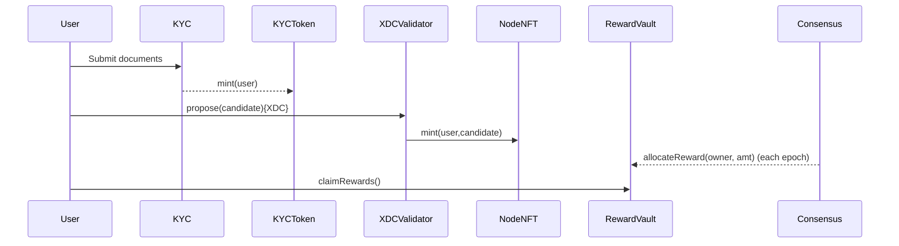

# Architecture – XDC Masternode Smart‑Contract Layer

## 1 Overview

The upgrade splits the monolithic **XDCValidator** system contract into a 
composable **three‑layer stack**:

| Layer | Contract | Purpose |
|-------|----------|---------|
| **Compliance** | `KYCToken` | Soul‑bound NFT proves that an address passed off‑chain KYC/AML. |
| **Ownership**  | `NodeNFT` | ERC‑721 that _wraps_ a validator slot; transfer = ownership change. |
| **Rewards**    | `RewardVault` | Escrows epoch rewards; owners claim on‑chain. |

`XDCValidator` remains the **single source of truth** for candidate stakes and
validator selection, but it defers KYC checks, ownership, and reward
accounting to the new contracts.

## 2 Data‑flow summary

* A **KYC‑verified** address can propose a node.
* On successful proposal, a **NodeNFT** is minted ➜ ownership on‑chain.
* The **consensus engine** credits epoch rewards to `RewardVault`, which tracks
  balances per owner.
* Owners (including contracts/multisigs) call `claimRewards()` at will.

## 3 Why this design?

* **Regulated DeFi** – masternodes become composable assets while enforcing KYC.
* **Safety** – tokenised ownership lets compromised keys transfer a node instead
  of destroying it.
* **Transparency** – every reward allocation is logged on‑chain, eliminating
  manual spreadsheets.
* **Future‑proof** – liquid staking, DAO ownership, or new KYC providers can be
  integrated by upgrading a single contract without touching consensus rules.
